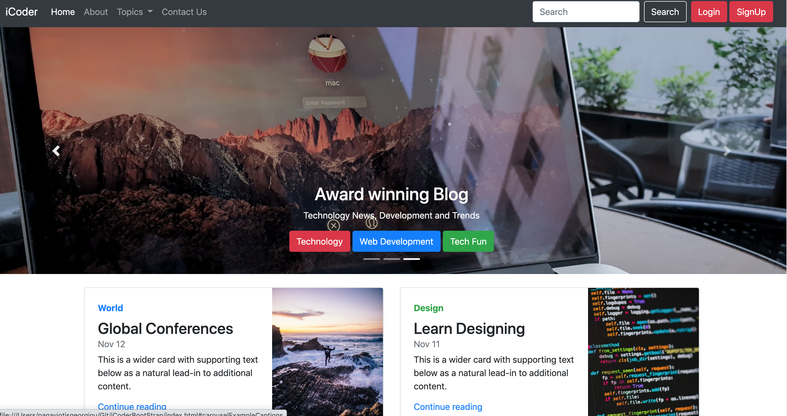

# iCoderBootStrap :sparkles:

To view a demo example, **[click here](live link goes here)**

This is a Basic Website Focussed On Frontend development

The project use Bootstrap 4 and it consists of the following pages:

- Homepage [check code](https://github.com/geeks5551/iCoderBootStrap/blob/master/index.html)
- About [check code](https://github.com/geeks5551/iCoderBootStrap/blob/master/about.html)
- Tutorial [check code](https://github.com/geeks5551/iCoderBootStrap/blob/master/turotial.html)
- Contact [check code](https://github.com/geeks5551/iCoderBootStrap/blob/master/contact.html)



## :rocket: How to use

1. Make a clone :

```sh
  $ git clone https://github.com/geeks5551/iCoderBootStrap
```

2. Add your information in the above page files

## ✨ Contributing

1. Fork this repository
2. Improve current code by:
    - improving the style
    - adding new feature
    - improving the documentation
3. Push your work and create a Pull Request